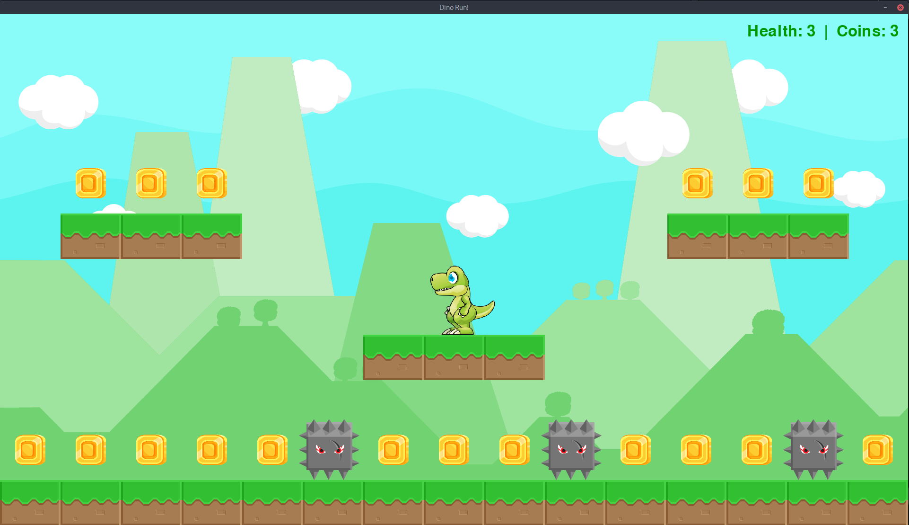

# Dino Run

This is my attempt at better understanding Object Oriented Programming by making a game using PyGame. 

## Getting Started

Install the `python3-pygame` and `pygame-devel` packages for your OS:
`dnf install python3-pygame pygame-devel -y`

Clone the respository and start the game by running `python3 dino-run.py`.  

### Game objectives

Control the Dino in order to collect as many coins as possible while avoiding ennemies.
Once all coins have been collected, a new series of coins will spawn.
When hit by an ennemy, the Dino moves back to its starting position and loses 1 Health point but keeps collected coins.
The game ends when no more Health points are available.

Use the A/W/D or the LEFT/UP/RIGHT arrow keys on your keyboard to control the Dino.
The Q key will quit the game.

### Credits
* Background / Tiles / Coins / Ennemy: https://bayat.itch.io/platform-game-assets
* Dinosaur: https://www.gameart2d.com/free-dino-sprites.html